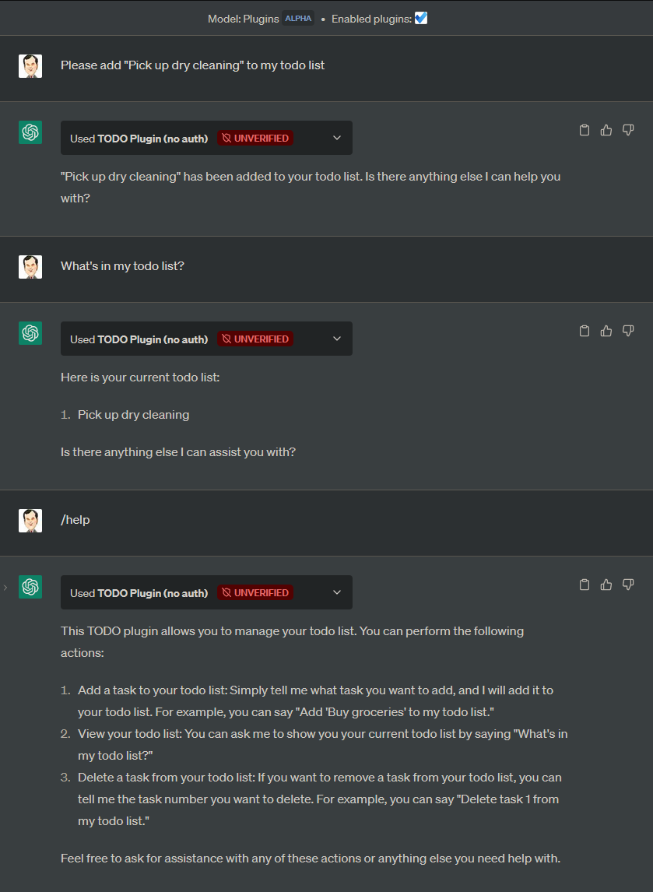

# ChatGPT Plugins Template — Todo Plugin

This is a replication of OpenAI's example plugin [Learn how to build a simple todo list plugin with no auth](https://platform.openai.com/docs/plugins/examples) using FastAPI.

Featuring:
- FastAPI based example with auto-generated `openapi.json` as the API manifest.
- `/` and `/help` endpoints

## Run
- Fork the [Repl.it](https://replit.com/@leehanchung/FastAPI-ChatGPT-Todo-Plugin)

- Click on `Run`

- [Read the ChatGPT Plugin Docs on how to install](https://openai.com/blog/chatgpt-plugins)**

## Examples

